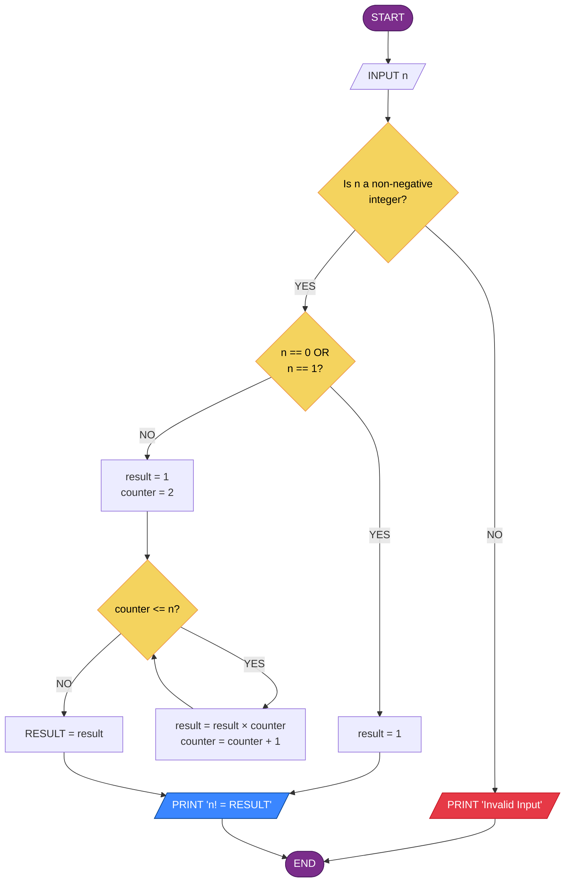

```mermaid
flowchart TD
    A([START]) --> B[/INPUT n/]
    B --> C{Is n a non-negative\ninteger?}
    C -- NO --> D[/PRINT 'Invalid Input'/]
    D --> Z([END])
    C -- YES --> E{n == 0 OR\nn == 1?}
    E -- YES --> R1[result = 1]
    E -- NO --> G[result = 1\ncounter = 2]
    G --> H{counter <= n?}
    H -- YES --> I[result = result × counter\ncounter = counter + 1]
    I --> H
    H -- NO --> J[RESULT = result]
    R1 --> OUT
    J --> OUT[/PRINT 'n! = RESULT'/]
    OUT --> Z

    style A fill:#7b2d8b,color:#fff,stroke:#4a1a5e
    style Z fill:#7b2d8b,color:#fff,stroke:#4a1a5e
    style C fill:#f4d35e,color:#000,stroke:#ee964b
    style E fill:#f4d35e,color:#000,stroke:#ee964b
    style H fill:#f4d35e,color:#000,stroke:#ee964b
    style D fill:#e63946,color:#fff,stroke:#c1121f
    style OUT fill:#3a86ff,color:#fff,stroke:#023e8a
```
