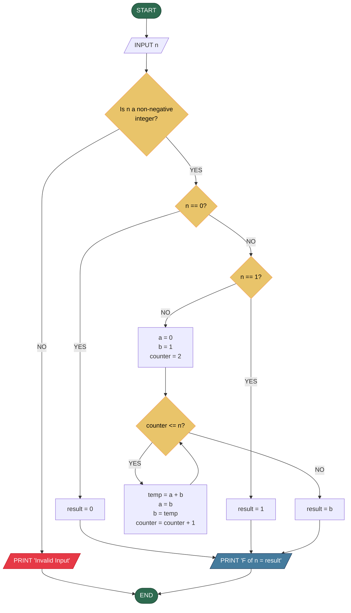

```mermaid
flowchart TD
    A([START]) --> B[/INPUT n/]
    B --> C{Is n a non-negative\ninteger?}
    C -- NO --> D[/PRINT 'Invalid Input'/]
    D --> Z([END])
    C -- YES --> E{n == 0?}
    E -- YES --> R0[result = 0]
    E -- NO --> F{n == 1?}
    F -- YES --> R1[result = 1]
    F -- NO --> G[a = 0\nb = 1\ncounter = 2]
    G --> H{counter <= n?}
    H -- YES --> I[temp = a + b\na = b\nb = temp\ncounter = counter + 1]
    I --> H
    H -- NO --> J[result = b]
    R0 --> OUT
    R1 --> OUT
    J --> OUT[/PRINT 'F of n = result'/]
    OUT --> Z

    style A fill:#2d6a4f,color:#fff,stroke:#1b4332
    style Z fill:#2d6a4f,color:#fff,stroke:#1b4332
    style C fill:#e9c46a,color:#000,stroke:#f4a261
    style E fill:#e9c46a,color:#000,stroke:#f4a261
    style F fill:#e9c46a,color:#000,stroke:#f4a261
    style H fill:#e9c46a,color:#000,stroke:#f4a261
    style D fill:#e63946,color:#fff,stroke:#c1121f
    style OUT fill:#457b9d,color:#fff,stroke:#1d3557
```
